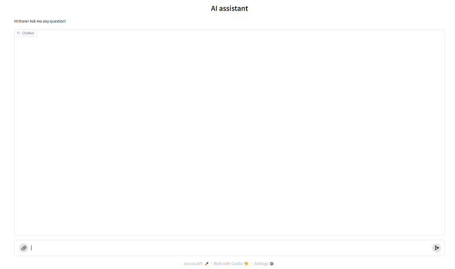
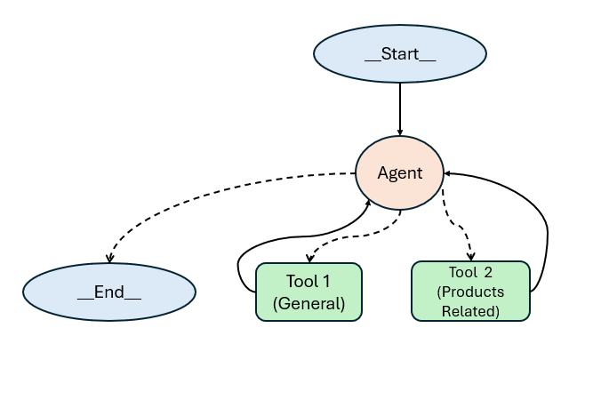

# AI Agent
This repository showcases an AI agent created in Langgraph with Gradio user interface. The user interface is a chat interface where the user can type in and/or attach an image and ask questions from the AI agent. Here is a snapshot of the user interface:



## Agent's tasks:

The Ai agent is able to perform 3 main tasks as following:
1) General chat with the user and answer general questions
2) Recommend/Find products based on user's text
3) Find products based on user's image

## Getting Started:

### Install the dependencies:
The required packages are avilable in the `requirement.txt` file.

```pip install -r requirements.txt```

### Create and set API keys:

Here I used OpenAI and Tavily search engine tools within the agent. API keys for these packages are required in your `.env` file. 

- Create a `.env` file:

```bash
cp .env.example .env
```
- Define required API keys in your `.env` file:

To use these packages, you need to create and pass API keys. Sign up and create the keys for [Tavily](https://app.tavily.com/home) and [OpenAI](https://auth.openai.com/create-account). Once you have your API key, add it to your `.env` file:

```OPENAI_API_KEY="your-api-key"```

```TAVILY_API_KEY="your-api-key"```

Important note: An API key is a unique code that identifies your requests to the API. Your API key is intended to be used by you and [must be kept private](https://help.openai.com/en/articles/5008148-can-i-share-my-api-key-with-my-teammate-coworker). See OpenAI's [Best Practices for API Key Safety](https://help.openai.com/en/articles/5112595-best-practices-for-api-key-safety).


### Use the AI agent:

You can run the jupyter notebook file `Ai-agent-run.ipynb`. The UI is within the jupyter notebook. You can easily use the agent whether within the notebook or by using the generated URL.

Alternatively you can run the `app.py`.

# Overview of the decision makings and the agent's structure

### Use of open-source packages

The AI agent is created using [Python](https://www.python.org/) programming language. This is an open source package with a wide range of libraries for various applications, including machine learning and data science application. Python is advantageous in high performance computing. The contributions of its large global community provide resourceful and up to date libraries and packages for scientific programming and AI. To create the agent I used open source packages [Langchain](https://python.langchain.com/docs/introduction/) and [Langgraph](https://langchain-ai.github.io/langgraph/).

### Use of Langgraph for creating the Agent
   
Langchain is an open-source framework to develop applications based on large language models [langchain website](https://python.langchain.com/docs/introduction/). I selected Langchain platform due to its resourceful documents and guides to learn, wide range of built-in libraries for large language model application and its compatibility with other packages. Although Langchain itself can be used to create a simple agent using their "Chain", when adding more complex features and functionalities, such as memory and persistence, Langgraph is advantageous in order to reduce the manual creation of those complex features. [This website](https://www.getzep.com/ai-agents/langgraph-tutorial) compares those two packages. Langgraph's framework was built based upon Langchain. I used Langgraph specifically to create the AI agent. Langgraph supports the developers to describe and control the functions, such as human in the loop, built-in persistence, cyclic graphs, multi-agents and controlled flow in graph structure. These are important factors in creating an agent that can perform well, specially controllability [[1]](https://www.deeplearning.ai/short-courses/ai-agents-in-langgraph/)

### Tools for the AI agent
To perform the tasks, we need to provide the agent with the proper tools. Here, I assumed that the agent has access to real-time web data specifically from Amazon.ca website for product search, while for answering general questions the agent has access to web data. So I defined two tools from Tavily **Tool1**:  TavilySearchResults and  **Tool2** :  TavilySearch

### Structure of the created AI agent
The agent is created based on LangGraph's [**reAct**](https://langchain-ai.github.io/langgraph/reference/agents/#langgraph.prebuilt.chat_agent_executor.create_react_agent) implementation, whic is a pre-built graph structure. Here is a visualization of the agent structure:



> Note on Handling memory in the Agent: I used an in-memory checkpointer and pass it to the agent. This enables the agent to remember the conversations and queries and get back to them, if necessary. I created a thread id for the start of the memory.

### User Interface
For interactive agent and being able to pass image and text data, I created the user interface utilizing open source package [Gradio](https://www.gradio.app/guides/quickstart). Gradio's [`ChatInterface`](https://www.gradio.app/docs/gradio/chatinterface) is a high-level abstraction for creating chatbot UIs. In just a few lines of codes it can create a web-based demo around a chatbot model. Here I created a run_agent function that is passed to Gradio's ChatInterface. The UI can be used within a jupyter notebook.

# Agent's documentation
More details on the agent's API and codes are provided in `AI-agent-doc.ipynb`.
